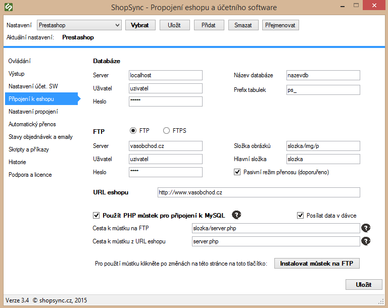
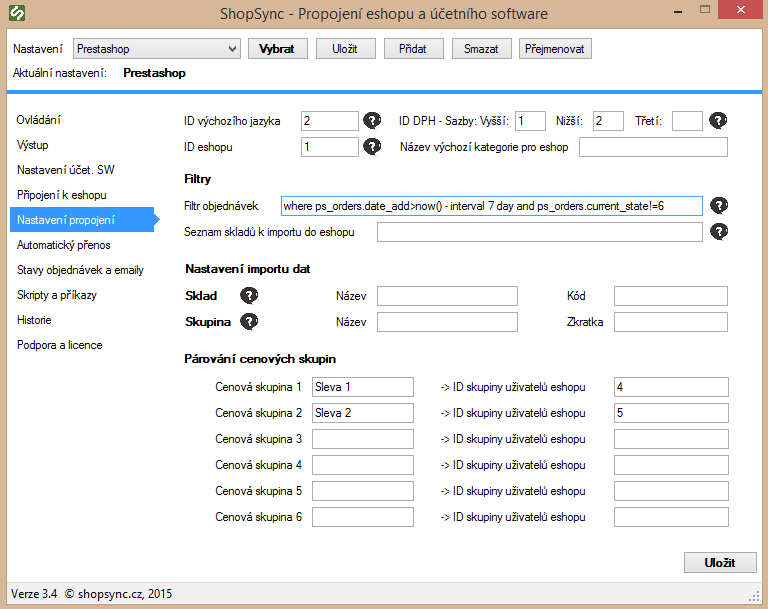

import Tabs from '@theme/Tabs';
import TabItem from '@theme/TabItem';


# Nastavení propojení s e-shopem

:::info Obsah návodu
- Vytvoření párovacích polí na DB e-shopu
- Výchozí nastavení programu
- Jak nastavit připojení k e-shopu
- Jak nastavit propojení
- Příklady správného nastavení
:::

## Vytvoření párovacích polí na databázi e-shopu

:::tip
Není nutné upravovat databázi pro použití zkušební verze programu.
:::

### Pro všechny platformy

```sql
CREATE TABLE `shopsync_last` (
  `table` varchar(45) COLLATE utf8_czech_ci NOT NULL,
  `dt` datetime DEFAULT NULL,
  PRIMARY KEY (`table`)
) ENGINE=MyISAM DEFAULT CHARSET=utf8 COLLATE=utf8_czech_ci;
```

### Pro PrestaShop

```sql
ALTER TABLE `ps_accessory` ADD COLUMN `sync_id1` INT NULL;
ALTER TABLE `ps_accessory` ADD COLUMN `sync_id2` INT NULL;
ALTER TABLE `ps_feature` ADD COLUMN `sync_id` INT NULL;
ALTER TABLE `ps_category` ADD COLUMN `sync_id` varchar(200) NULL;
ALTER TABLE `ps_category` ADD COLUMN `sync_fn` varchar(200) NULL;
ALTER TABLE `ps_product` ADD COLUMN `sync_id` INT NULL;
ALTER TABLE `ps_product` ADD COLUMN `sync_storage` varchar(200) NULL;
ALTER TABLE `ps_feature` ADD COLUMN `sync_unit` varchar(45) NULL;
ALTER TABLE `ps_image` ADD COLUMN `sync_fn` varchar(200) NULL;
ALTER TABLE `ps_product` ADD COLUMN `sync_db` varchar(200) NULL;
ALTER TABLE `ps_product` ADD COLUMN `guid` varchar(200) NULL;
ALTER TABLE `ps_product_attribute` ADD COLUMN `guid` varchar(200) NULL;
ALTER TABLE `ps_group` ADD COLUMN `sync_id` INT NULL;
ALTER TABLE `ps_customer` ADD COLUMN `guid` VARCHAR(45) NULL;
```

### Pro VirtueMart 2

```sql
ALTER TABLE `jos_virtuemart_categories` ADD COLUMN `sync_id` INT NULL;
ALTER TABLE `jos_virtuemart_medias` ADD COLUMN `sync_id` INT NULL;
ALTER TABLE `jos_virtuemart_products` ADD COLUMN `sync_id` INT NULL;
ALTER TABLE `jos_virtuemart_products` ADD COLUMN `sync_storage` varchar(200) NULL;
ALTER TABLE `jos_virtuemart_customs` ADD COLUMN `sync_id` INT NULL;
ALTER TABLE `jos_virtuemart_customs` ADD COLUMN `sync_unit` VARCHAR(45) NULL;
ALTER TABLE `jos_virtuemart_products` ADD COLUMN `sync_db` VARCHAR(45) NULL;
ALTER TABLE `jos_virtuemart_products` ADD COLUMN `guid` VARCHAR(45) NULL;
ALTER TABLE `jos_virtuemart_customs` ADD COLUMN `guid` VARCHAR(200) NULL;
ALTER TABLE `jos_virtuemart_shoppergroups` ADD COLUMN `sync_id` INT NULL;
ALTER TABLE `jos_virtuemart_vmusers` ADD COLUMN `guid` VARCHAR(45) NULL;
```

### Pro OpenCart

```sql
ALTER TABLE `oc_attribute` ADD COLUMN `sync_id` INT NULL;
ALTER TABLE `oc_attribute` ADD COLUMN `sync_unit` VARCHAR(45) NULL;
ALTER TABLE `oc_category` ADD COLUMN `sync_id` INT NULL;
ALTER TABLE `oc_product` ADD COLUMN `sync_id` INT NULL;
ALTER TABLE `oc_product` ADD COLUMN `sync_storage` varchar(200) NULL;
ALTER TABLE `oc_product` ADD COLUMN `sync_db` varchar(200) NULL;
ALTER TABLE `oc_product_related` ADD COLUMN `sync_id1` INT NULL;
ALTER TABLE `oc_product_related` ADD COLUMN `sync_id2` INT NULL;
ALTER TABLE `oc_product_option_value` ADD COLUMN `sync_code` VARCHAR(45) NULL;
ALTER TABLE `oc_product` ADD COLUMN `guid` varchar(200) NULL;
ALTER TABLE `oc_product_option_value` ADD COLUMN `guid` VARCHAR(200) NULL;
ALTER TABLE `oc_customer_group` ADD COLUMN `sync_id` INT NULL;
ALTER TABLE `oc_customer` ADD COLUMN `guid` VARCHAR(45) NULL;
```

### Pro VirtueMart 1

```sql
ALTER TABLE `jos_vm_category` ADD COLUMN `sync_id` INT NULL;
ALTER TABLE `jos_vm_product` ADD COLUMN `sync_id` INT NULL;
ALTER TABLE `jos_vm_product` ADD COLUMN `sync_storage` varchar(200) NULL;
ALTER TABLE `jos_vm_product` ADD COLUMN `sync_db` VARCHAR(45) NULL;
ALTER TABLE `jos_vm_product` ADD COLUMN `guid` VARCHAR(45) NULL;
ALTER TABLE `jos_vm_shopper_group` ADD COLUMN `sync_id` INT NULL;
```

> `ps_`, `jos_virtuemart_` a `oc_` jsou prefixy tabulek, které definujete při instalaci e-shopu – mohou se lišit a je nutné je v příkazech přizpůsobit.

:::info WooCommerce
Pro WooCommerce není třeba databázi upravovat.
:::

## Výchozí nastavení programu

- **Kořen stromu kategorií** – Prestashop: ID 2, ostatní: ID 1.
- **Atribut pro varianty zboží** – individuálně dle projektu.
- **Cache v e-shopu** – doporučeno deaktivovat nebo snížit její platnost.
- **CRON pro index ve vyhledávání (PrestaShop)** – nutné nastavit.

## Nastavení připojení k e-shopu

Dvě možnosti připojení:

- **Přímý přístup do DB** – přes IP a port.
- **Propojovací můstek (PHP)** – na FTP.

### Postup

1. Zadejte přístupové údaje k DB a FTP.
2. Vyplňte úplné URL e-shopu (včetně http/https).
3. Při použití můstku:
   - zaškrtněte „Použít PHP můstek“
   - vyplňte cestu k můstku na FTP a cestu z URL e-shopu
4. Zaškrtněte „Posílat data v dávce“
5. Klikněte na „Instalovat můstek na FTP“



## Nastavení propojení

1. _ID výchozího jazyka_ – doplňte kód jazyka podle platformy

<Tabs groupId="platform-language">
<TabItem value="virtuemart" label="VirtueMart">

- Čeština: `cs_cz`  
- Slovenština: `sk_sk`  
- Angličtina: `en_gb`  

</TabItem>
<TabItem value="others" label="PrestaShop / OpenCart / WooCommerce">

- Číslo označující ID výchozího jazyka  
- Zjistíte ho buď v administraci e-shopu nebo v databázové tabulce obsahující seznam nainstalovaných jazyků  

</TabItem>
</Tabs>

> Pokud bude nastavení špatně, program nevypíše chybu při přenosu, ale nahraná data (produkty, kategorie, …) nebudou po přenosu v e-shopu vidět, protože mohou být nahrána pro neexistující jazykové nastavení.

---

2. _Filtr objednávek_ – Účetní systém rozliší duplikáty objednávek podle jejich čísla, ale je lepší nastavit filtr, aby se nemusely stahovat všechny objednávky.

<Tabs groupId="platform-orders">
<TabItem value="virtuemart" label="VirtueMart">

```sql
where o.order_status='P'
```

„P“ jako „Pending“, tj. „Ve zpracování“.

</TabItem>
<TabItem value="opencart" label="OpenCart">

```sql
where o.order_status_id='1'
```

„1“ je číslo stavu objednávky.

</TabItem>
<TabItem value="prestashop" label="PrestaShop">

**Před verzí 1.5.1**:
```sql
4
```

**Po verzi 1.5.1**:
```sql
where ps_orders.current_state='1'
```

</TabItem>
<TabItem value="woocommerce" label="WooCommerce">

```sql
where t.name='on-hold'
```
nebo  
```sql
where t.name='processing'
```

</TabItem>
</Tabs>

> Tyto stavy je možné kombinovat, tedy není nutné stahovat pouze objednávky v jednom stavu – v případě příkazů začínajících `where` se kombinace provádí spojkou `or`, např.:  
> `where ps_orders.current_state='1' or ps_orders.current_state='2'`

> Občas je vhodné přidat i omezení maximálního stáří objednávky – toto je však již nad rámec tohoto návodu, pro postup se v případě zájmu informujte.

---

3. _ID nastavení daně_ – vyplňte ID hodnot jednotlivých sazeb daně v e-shopu (zjistíte z příslušných tabulek v databázi či administrace). Je třeba, aby nastavení DPH v propojovacím programu a nastavení DPH v e-shopu bylo totožné.

4. _Seznam skladů k importu do e-shopu_ – pokud chcete importovat zboží pouze z určitých skladů, je možné zde zadat výčet oddělený znakem `;`.

5. _Párování cenových skupin_

- Do levé části zadejte název cenové skupiny, např. „Sleva 1“ pro použití se SW Pohoda.  
  Pro použití se SW Money záleží na konkrétní konfiguraci – může jít buď o číslo 1–5 označující cenovou hladinu, nebo o název cenové skupiny.  
- Do pravé části zadejte ID skupiny uživatelů v e-shopu:  
  - Výchozí skupina pro **PrestaShop** je `0`  
  - Výchozí skupina pro ostatní e-shopy je `1`



