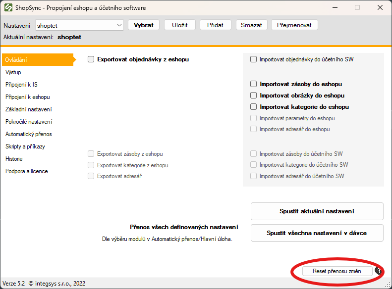
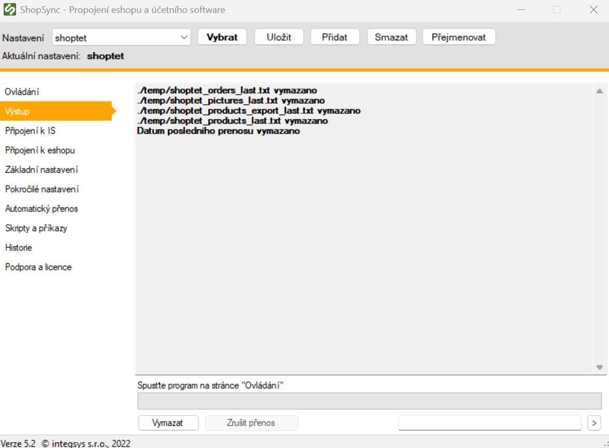

:::info K čemu to slouží ?
Reset přenosu změn slouží k vynucení kompletní synchronizace všech dat mezi e-shopem a účetním softwarem, jako by šlo o první přenos.
:::
---

## ✅ Postup krok za krokem:

**1.** Spusťte aplikaci **ShopSync**.

**2.** V pravém dolním rohu hlavního okna klikněte na tlačítko **„Reset přenosu změn“**.

**3**. Počkejte na dokončení operace.
**4**. Po provedení resetu budete **automaticky přesměrováni na záložku „Výstup“**, kde se zobrazí potvrzení o úspěšném resetu.

---

:::caution Důležité upozornění

- Po resetu se při příštím spuštění přenosu **načítají všechna data znovu**, včetně produktů, obrázků, faktur, zákazníků a adresářů.
- **První synchronizace může trvat i několik hodin**, v závislosti na množství dat v e-shopu a účetním systému.
- **Nedoporučujeme provádět reset bez doporučení technika nebo podpory ShopSync.**

:::

---

:::tip Kdy použít reset?

Reset přenosu změn je vhodné použít pouze v případech, jako jsou:

- kompletní migrace dat,
- rozsáhlé změny v e-shopu či účetním systému,
- řešení problémů se synchronizací za asistence technické podpory ShopSync.

:::
