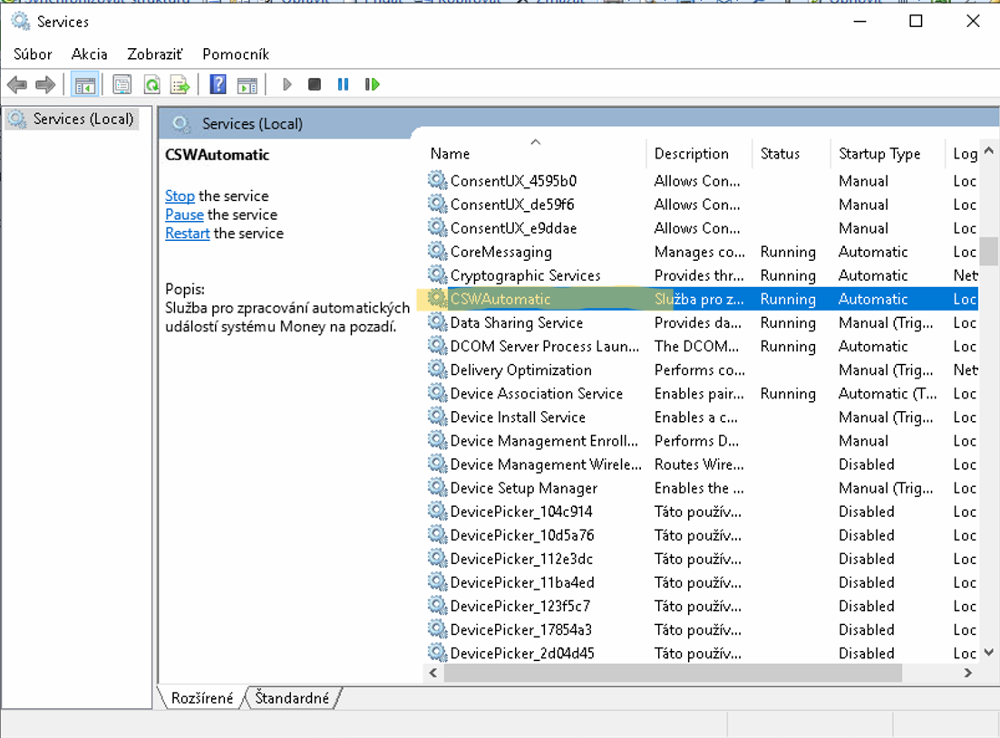
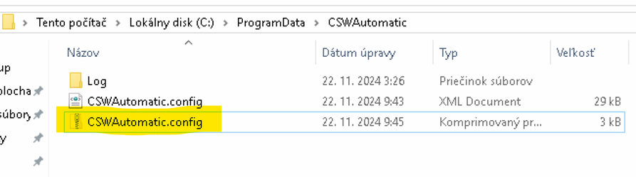
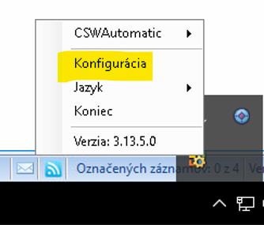
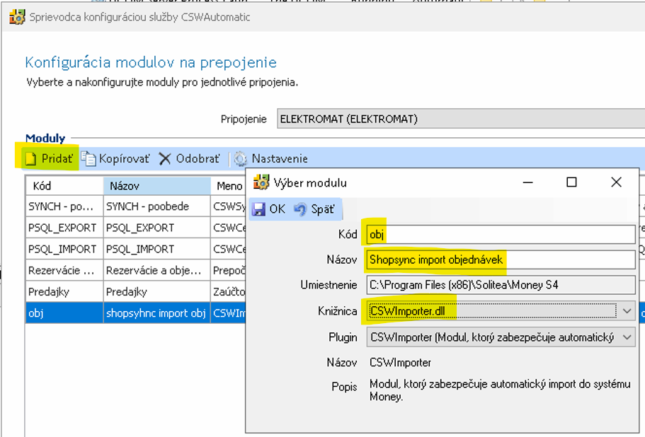
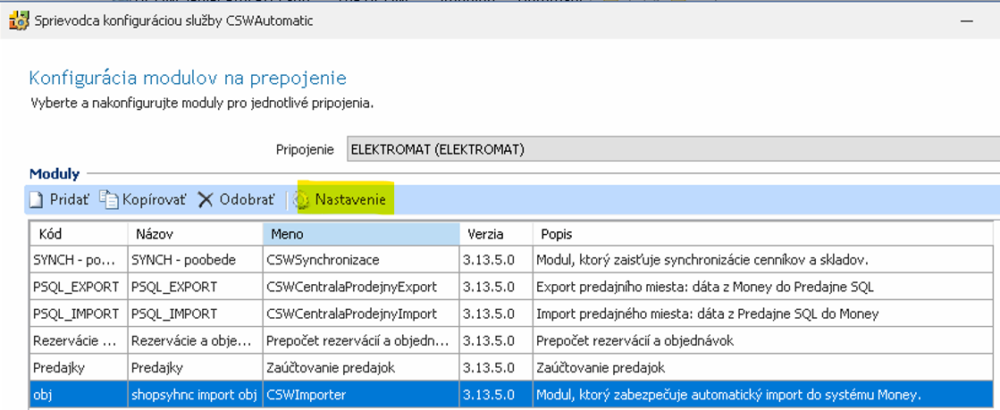
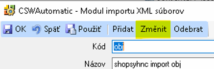

Tento návod slouží ke správnému nastavení importu objednávek z XML souborů pomocí modulu `CSWAutomatic` ve Money S4/S5.

---

## 1️⃣ Zkontrolujte, zda běží služba *CSWAutomatic*

Otevřete `services.msc` a zkontrolujte, že služba **CSWAutomatic** je ve stavu **Running** a spouští se automaticky.

---

## 2️⃣ Udělejte kopii konfigurace

:::caution Doporučeno:
Přejděte do složky `C:/ProgramData/CSWAutomatic` a zálohujte soubor `CSWAutomatic.config`.
:::
:::tip Proč?
Po úpravě nastavení může dojít ke smazání konfigurace, pokud se stane chyba.
:::

---

## 3️⃣ Spusťte průvodce konfigurací

Klikněte pravým tlačítkem na ikonu CSWAutomatic a zvolte **Konfigurácia**.

---

## 4️⃣ Přidejte nový modul

Zvolte možnost **Přidat** a vyplňte:

- **Kód:** `obj`
- **Název:** `Shopsync import objednávek`
- **Umístění:** `C:/Program Files (x86)/Solitea/Money S4`
- **Knihovna:** `CSWImporter.dll`

---

## 5️⃣ Nastavte sledovanou složku a plán

#### a) Vyberte modul a klikněte na **Nastavenie**

#### b) Klikněte na **Změnit**

#### c) Vyplňte:

:::note Následující:
- **Monitorovaný adresář:** např. `C:/shopsync_temp/obj`
- **Maska:** `.xml`
- **Kód importu v Money:** `eshopobj`
- **Po úspěšném importu:** `Smazat`
- **Po neúspěšném importu:** `Smazat`
- **Čas monitorování:** od `06:00` do `22:00`
:::

---

## 6️⃣ Uložte nastavení

Zkontrolujte, že modul je aktivní a zobrazuje se v přehledu.

---

## 7️⃣ Dokončete průvodce

Klikněte na **Další** a poté **Dokončit**.

---

> ✅ Nyní je služba nastavena k automatickému zpracování objednávek.