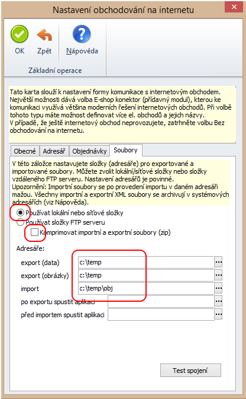
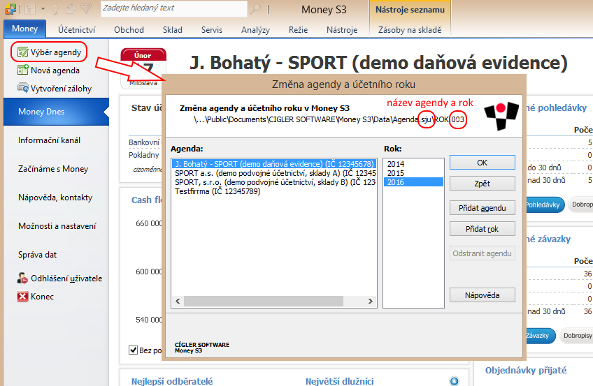
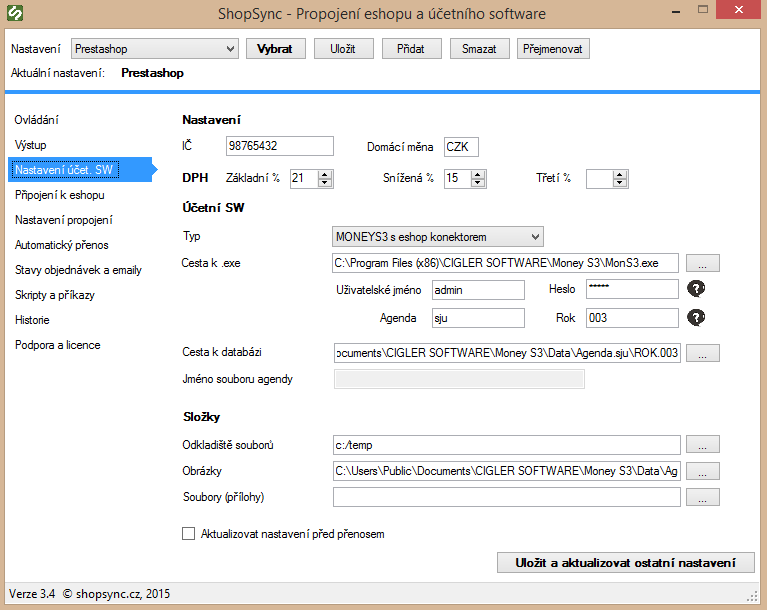

# Nastavení pro propojení se SW MoneyS3

:::info Návod obsahuje:
Obecné pokyny, nastavení e-shop konektoru, propojení s MoneyS3 a příklady správné konfigurace.
:::
---

## Obecné pokyny

**.NET Framework**  
Program spustíte souborem `ShopSync.exe` ve složce s aplikací. Pro správný běh je nutný .NET Framework 3.5.  
Ten je součástí systémů Windows 7–11. Pokud však program ohlásí chybu, že komponenta chybí, nainstalujte ji například z:
[https://www.microsoft.com/cs-cz/download/details.aspx?id=21](https://www.microsoft.com/cs-cz/download/details.aspx?id=21)

**Párování produktů**  
Produkty se párují podle katalogového čísla v Money. Pokud potřebujete párovat podle jiného údaje (např. EAN), lze to přenastavit ve skriptech – v případě potřeby kontaktujte [podpora@shopsync.cz](mailto:podpora@shopsync.cz).

---

## Nastavení e-shop konektoru v MoneyS3

> Tato část platí pouze pro plnou verzi MoneyS3 s aktivovaným e-shop konektorem.  
> Pokud používáte zkušební verzi nebo verzi bez konektoru, tuto sekci přeskočte.

1. V Money zvolte: `Možnosti a nastavení → Obchodnování na internetu`.
2. Jako typ obchodního domu vyberte `E-shop konektor`.
3. Na kartě **Soubory** nastavte složku pro výměnu dat (např. `C:/temp`).  
   Tato složka musí být shodná s nastavením v propojení aplikace (viz níže).

---

## Nastavení propojení s MoneyS3

1. Zjistěte název agendy a rok.  
   V Money zvolte `Výběr agendy`, podívejte se na cestu k databázi, např.:  
   `..\MoneyS3\Data\Agenda.sju\ROK.003`  
   V tomto příkladu:
   - Název agendy: `sju`
   - Rok: `003`

   

2. Vyplňte IČ, měnu a sazby DPH.
3. Uveďte cestu ke spustitelnému souboru `MonS3.exe`.
4. Zvolte typ připojení:
   - S konektorem (běžná verze)
   - Bez konektoru (zkušební režim)

5. Vyplňte název agendy a rok podle bodu 1.
6. Vytvořte složku např. `C:/temp` a nastavte ji jako *Odkladiště souborů*.
7. Vyplňte cestu ke složce s obrázky, např.:  
   `C:/Users/Public/Documents/CIGLER SOFTWARE/Money S3/Data/Agenda.sju/Obrazky`

8. Uložte nastavení tlačítkem **Uložit a aktualizovat ostatní nastavení**.

---

## Příklad správného nastavení

