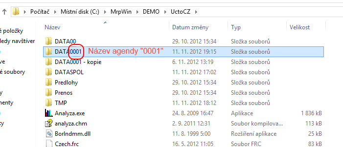
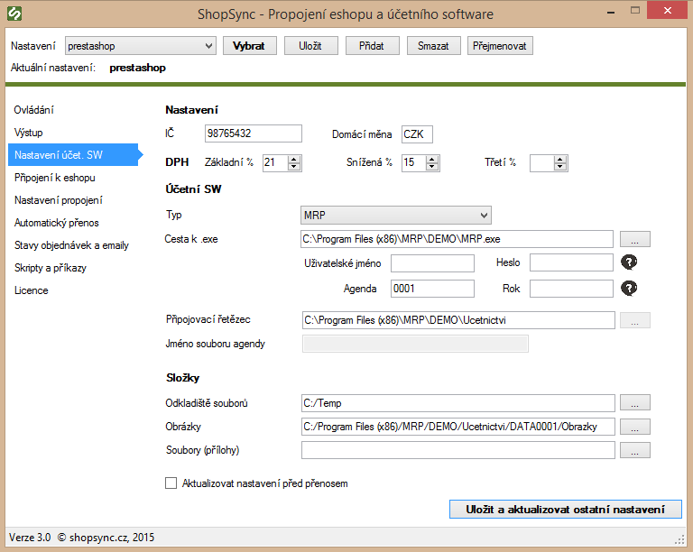

### Návod obsahuje

*Obecné pokyny, Nastavení připojení k databázi MRP, Příklad správně vyplněného nastavení*

---

## Obecné pokyny

**Párování produktů**
Produkty se párují v základním nastavení **podle čísla karty**. Tento údaj lze upravit úpravou v přenosových skriptech.
V případě potřeby nás kontaktujte na [podpora@shopsync.cz](mailto:podpora@shopsync.cz)

**Databázový ovladač**
Aby propojení fungovalo, je třeba mít nainstalovaný databázový **ovladač pro přístup k dBase databázi**.
Obvykle je předinstalovaný, ale pokud chybí, můžete ho doinstalovat např. zde:
[Distribuovatelný databázový stroj Microsoft Access 2016](https://www.microsoft.com/cs-cz/download/details.aspx?id=54920&msockid=010bf52cded26ad13f82e0e9df906b2c)

**Návody**
Další informace o napojení na konkrétní e-shop naleznete v příslušném návodu.

---

## Nastavení připojení k databázi MRP

1. Zjistěte název agendy – odpovídá 4 místnému číslu v datové složce firmy za textem `DATA`.

   
2. Vyplňte IČ, měnu a daňové sazby.
3. Vyplňte název agendy (zjištěný v bodě 1).
4. Do pole **Propojovací řetězec** zadejte cestu ke složce, která obsahuje datovou složku firmy (např. `C:\MRP\DATA1234`).
5. Vytvořte složku `C:\temp` (nebo jinou) a nastavte ji jako **Odkladiště souborů**.
6. Najděte a nastavte složky pro ukládání obrázků a souvisejících souborů – obvykle složka `OBRAZKY` ve složce firmy.
7. Klikněte na tlačítko **Uložit a aktualizovat ostatní nastavení**.

---

## Příklad vyplněného nastavení

