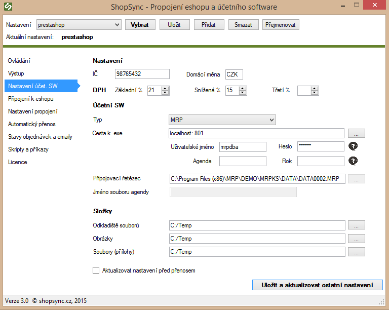

:::info Tento návod obsahuje:
Obecné pokyny, nastavení autonomního režimu, vyplnění údajů pro připojení, ukázka vyplněného nastavení.
:::

## Obecné pokyny

**Párování produktů**  
Produkty se párují v základním nastavení podle EAN kódu. Tento údaj je možné upravit na jiný kód (např. číslo karty) pouze úpravou v přenosových skriptech. V případě potřeby kontaktujte [podpora@shopsync.cz](mailto:podpora@shopsync.cz).

**Autonomní režim**  
Komunikace s MRP K/S probíhá přes autonomní režim. Pro funkční propojení je nutné, aby na PC bylo spuštěno MRP K/S v autonomním režimu – ideálně jako akce po startu systému.

Příklad příkazu pro spuštění:

```bash
"C:\Program Files (x86)\MRP\DEMO\MRPKS\MRPKS.EXE" -A -F2 -Ymrpdba,mrpdba
```
---

## Nastavení autonomního režimu

Podrobnosti k nastavení najdete na oficiální stránce MRP:  
[Autonomní režim MRP K/S](http://www.mrp.cz/software/ucetnictvi/ks/autonomni-rezim.asp#CHAPTER_1_0)

1. V nastavení autonomního režimu nastavte port, na kterém bude probíhat komunikace:


2. Povolte použití profilů: `EXPE00`, `EXPE01`, `IMPE00`.  
   U všech těchto profilů doplňte potřebná nastavení (např. číslo skladu, středisko, číselné řady).


---

## Vyplnění údajů pro připojení

1. Vyplňte IČ, měnu a daňové sazby.
2. Zadejte adresu serveru včetně portu, pokud není výchozí.

   Například:
   ```
   https://localhost:801
   ```

   (Pokud server běží lokálně a používá port `801` – více o nastavení viz [oficiální dokumentace](http://www.mrp.cz/software/ucetnictvi/ks/autonomni-rezim.asp#CHAPTER_1_0))

3. Do pole **Propojovací řetězec** zadejte cestu k databázi MRP.
4. Vyplňte přihlašovací jméno a heslo pro MRP K/S.
5. Vytvořte složku `C:\temp` nebo jinou a nastavte ji jako **Odkladiště souborů**.
6. Zadejte cesty ke složkám pro ukládání obrázků a příloh.
7. Klikněte na **Uložit a aktualizovat ostatní nastavení**.

---

## Ukázka vyplněného nastavení


