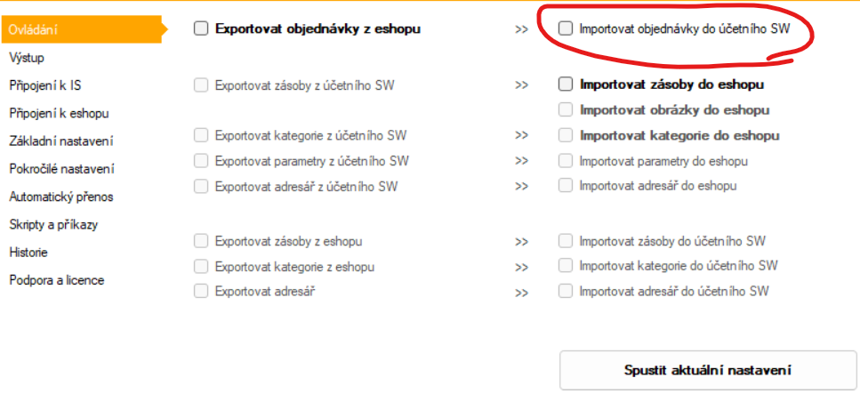
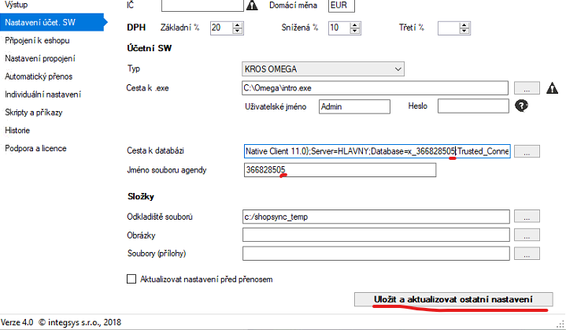
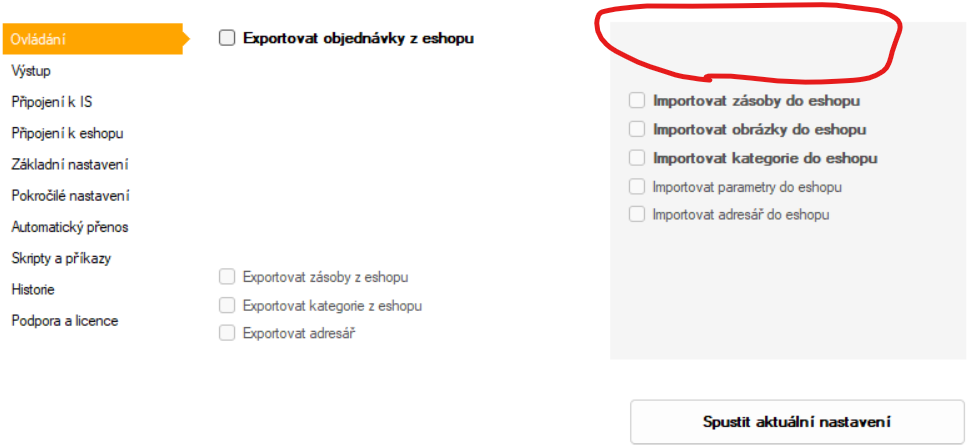
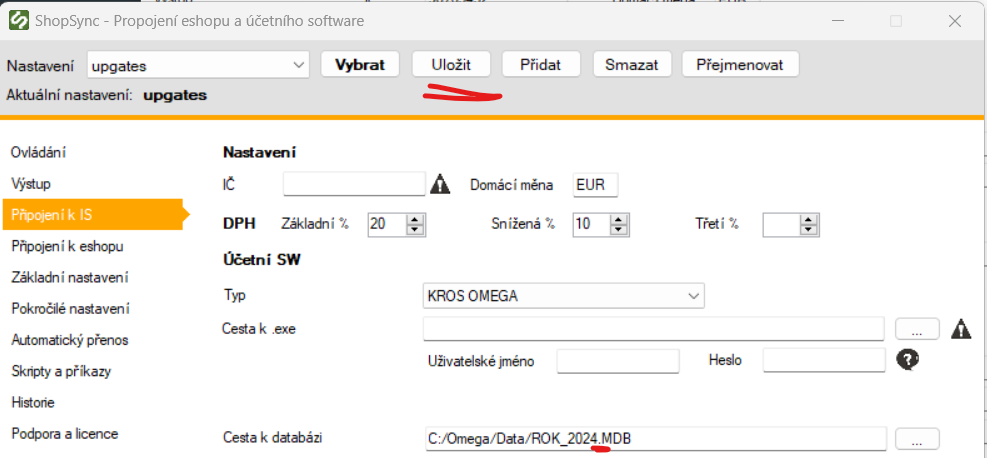

import Tabs from '@theme/Tabs';
import TabItem from '@theme/TabItem';

# Přepnutí na novou účetní jednotku v Omeze

:::info
Při změně účetního období nebo založení nové účetní jednotky v systému **Omega** je potřeba upravit nastavení připojení v aplikaci.
:::
---

## 1. Úprava cesty k databázi

Zkontrolujte a případně upravte:

- **název MDB souboru** (pro Access databázi),
- **cestu k databázi** v konfiguračním souboru nebo aplikaci,
- **připojovací řetězec**, pokud používáte **SQL Server**.

Obvykle se mění pouze poslední číslo v názvu databáze (např. `omega9.mdb` → `omega10.mdb`).

---

## 2. Uložení a aktualizace nastavení

Přejděte na kartu **Připojení k IS / Nastavení účetního SW**.

<Tabs groupId="omega-import">
<TabItem value="visible" label="Checkbox je viditelný">

- Přejděte na záložku **Ovládání**
- Pokud je zaškrtnutý checkbox **„Importovat objednávky do účetního SW“**, klikněte na `Uložit a aktualizovat nastavení`

</TabItem>
<TabItem value="hidden" label="Checkbox není viditelný">

- Pokud checkbox není vidět, klikněte pouze v horní liště na `Uložit`

</TabItem>
</Tabs>

---

Po uložení nastavení je možné otestovat přenos nebo pokračovat v běžném používání.
