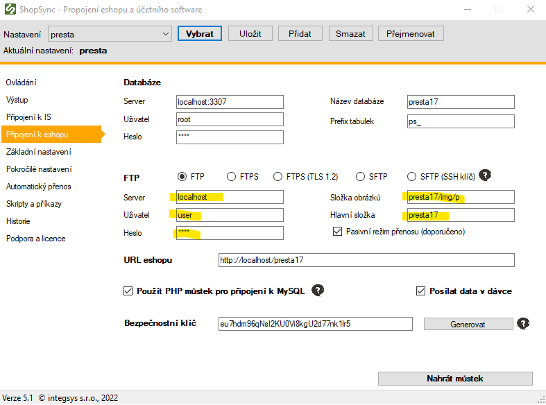
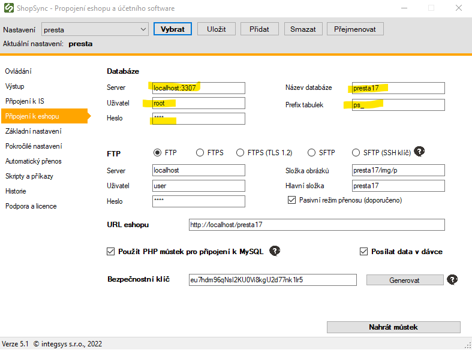
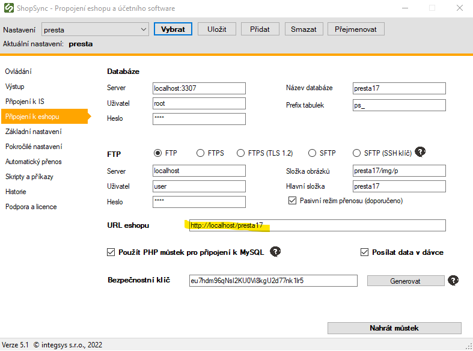
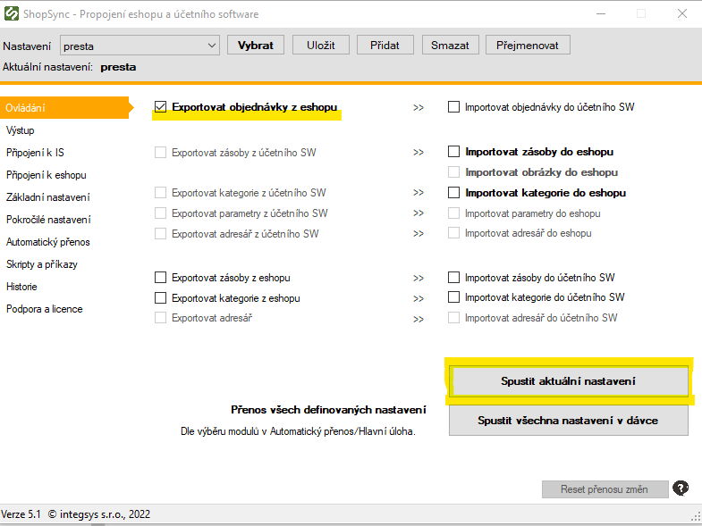

# Aktualizace přístupových údajů

:::warning Po přechodu na nový e-shop, změně hostingu nebo po delší době může dojít k neplatnosti:
- FTP přihlašovacích údajů
- nebo údajů pro připojení k databázi e-shopu

Tato stránka slouží jako návod pro obnovení přístupu a ověření správnosti nastavení.
:::
---

## 1. Zkontrolujte a upravte FTP připojení

Přejděte do **karty nastavení e-shopu** a ověřte:

- server
- uživatelské jméno
- heslo
- typ připojení (SFTP)

:::tip
Pokud si nepamatujete heslo, vytvořte si nový FTP účet v administraci hostingu.
:::

---

## 2. Zkontrolujte přístup k databázi

Zadejte správné údaje pro připojení do databáze e-shopu:

- název serveru (hostitel)
- uživatelské jméno a heslo
- název databáze

---

## 3. Ověřte URL adresu e-shopu

Pokud se změnila doména nebo adresa administrace, aktualizujte také **URL adresu e-shopu**:

:::warning Po každé změně nezapomeňte kliknout na **„Uložit“**!
:::
---

## 4. Otestujte přenos

Po uložení nového nastavení spusťte ruční přenos pro ověření funkčnosti:

:::tip Pokud přenos proběhne bez chyb, nastavení je správně zadané.
:::
