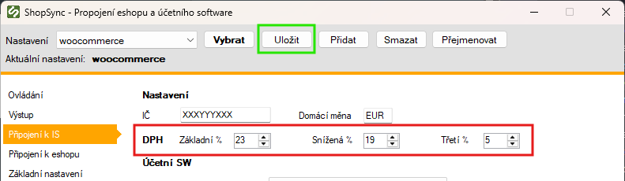
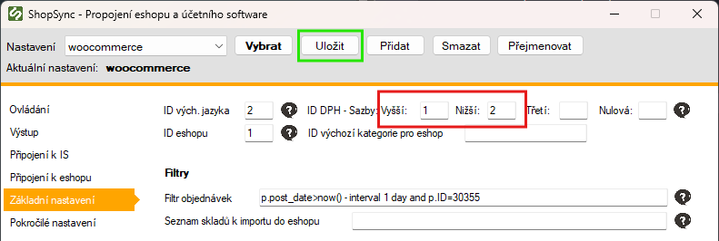

:::info Tento návod se týká pouze slovenských firem.
:::

Pokud fakturujete na Slovensko v rámci OSS režimu nebo máte druhou registraci k DPH, stačí na e-shopu a v účetním systému správně nastavit sazby. Změna konfigurace aplikace je nutná jen v určitých případech.

Pokud používáte Prestashop, WooCommerce nebo OpenCart, vznikne vám nová daňová třída – její ID je potřeba upravit podle instrukcí v sekci níže.

---

## Nastavení v desktopové aplikaci

### Nastavení sazeb DPH

Otevřete aplikaci ShopSync (obvykle `C:/shopsync/shopsync.exe`).
Zvolte možnost **Nastavení účetního SW** nebo **Připojení k IS** (záleží na verzi).

Zobrazí se konfigurační karta, kde upravte sazby DPH následovně:

- Základní sazba: `23`
- Snížená sazba: `19`
- Třetí sazba: `5`

Poté klikněte na **Uložit**.



---

### Daňové třídy

:::info Tato část je určena hlavně pro Prestashop, WooCommerce, OpenCart, a další platformy, kde dochází k přidání nové daňové třídy.
:::
:::warning Pokud používáte Shoptet, Upgates, Base, CreativeSites apod., nemusíte tuto část řešit.
:::
V případě změny nebo přidání nové daňové třídy je potřeba:

- V e-shopu vytvořit novou daňovou třídu
- Upravit konfiguraci ShopSync aplikace a zadat nová ID tříd

Zadejte nová ID zde:




---

Pokud používáte můstek na FTP (Prestashop, OpenCart, VirtueMart a někdy i WooCommerce), otevřete:

- **Připojení k eshopu / Instalovat můstek na FTP**

A pokud již proběhl přenos dat, doporučuje se:

- **Ovládání / Reset přenosu změn**

---

## Použití při webhostovaném nasazení

V případě, že aplikaci provozujete na vlastním webserveru:

1. Najděte ve složce s aplikací soubor `config.php`
2. Upravte hodnoty těchto konstant:

```php
define("set_vat", 23);       // Základní DPH
define("set_vatlow", 19);    // Snížené DPH
define("set_vatthird", 5);   // Třetí DPH
```

3. Pokud vám vznikla nová daňová třída, změňte také ID dané třídy na stejném místě:

```php
define("taxclass",'1');       // ID vaší základní sazby
define("taxclasslow",'2');    // ID snížené sazby
define("taxclassthird",'');   // ID třetí sazby
define("taxclassnull",'')     // ID nulové sazby
```