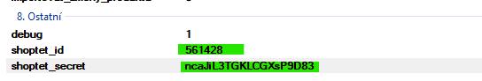
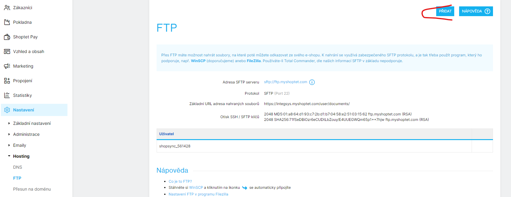
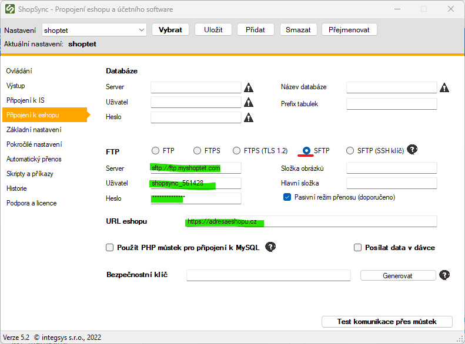
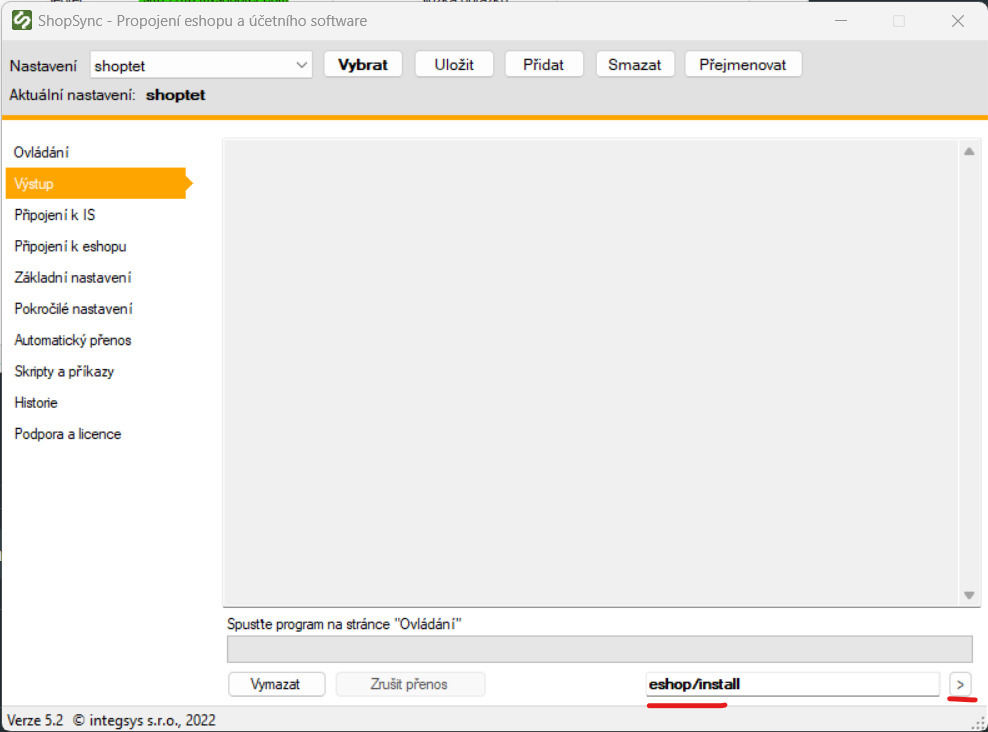

:::info
Tato stránka popisuje detailní konfiguraci napojení na e-shop běžící na platformě **Shoptet**.
:::

## Záložka Pokročilé nastavení

1. V sekci **8. Ostatní** je potřeba vyplnit:

   - `shoptet_id` – ID e-shopu na Shoptetu
   - `shoptet_secret` – tajný klíč pro přístup (získá se po instalaci doplňku)



---

## Záložka Připojení k e-shopu

1. Vyplňte **adresu e-shopu** – včetně `https://`, aby nedocházelo k přesměrování.

2. Pouze pokud používáte přenos souborů (obrázky, XML feedy apod.), vyplňte sekci **FTP**:

   - Nejprve vytvořte nový FTP účet v administraci e-shopu.
   - Zapamatujte si nastavené heslo.



3. Vyplňte údaje:

   - **Server**
   - **Uživatelské jméno**
   - **Heslo**
   - Typ připojení: `SFTP`



---

## Záložka Výstup

Pro správné fungování webhooků v Shoptetu je potřeba:

- Spustit jednorázově příkaz:

```bash
eshop/install
```

Tím dojde k automatické registraci webhooků v rámci doplňku.


